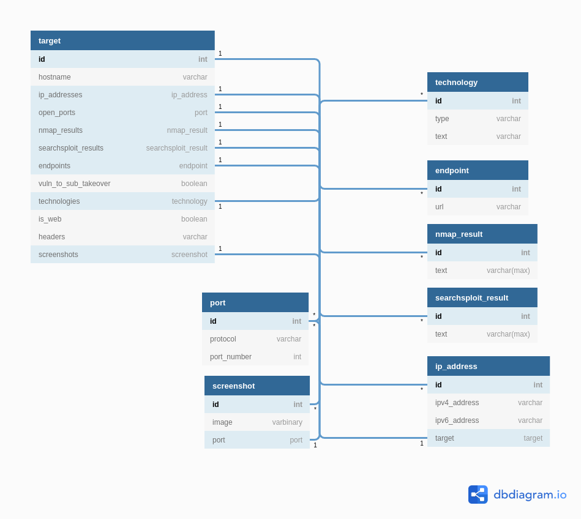

Database Models
===============

Target Model
############

.. autoclass:: pipeline.models.target_model.Target

Endpoint Model
##############

.. autoclass:: pipeline.models.endpoint_model.Endpoint

IP Address Model
################

.. autoclass:: pipeline.models.ip_address_model.IPAddress

Nmap Model
##########

.. autoclass:: pipeline.models.nmap_model.NmapResult

Port Model
##########

.. autoclass:: pipeline.models.port_model.Port

Screenshot Model
################

.. autoclass:: pipeline.models.screenshot_model.Screenshot

Searchsploit Model
##################

.. autoclass:: pipeline.models.searchsploit_model.SearchsploitResult

Technology Model
################

.. autoclass:: pipeline.models.technology_model.Technology

