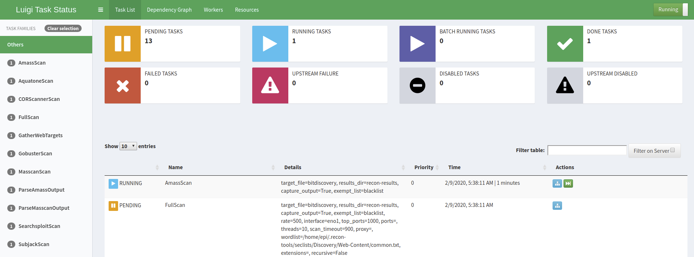
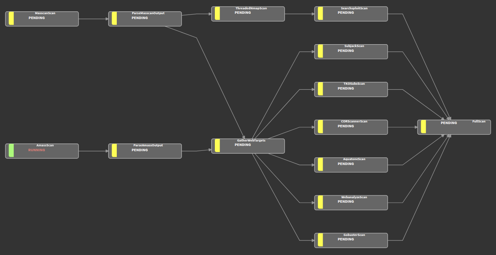

.. _visualization-ref-label:

Visualizing Tasks
=================

Setup
#####

To use the web console, you'll need to :ref:`install the luigid service<install-ref-label>`.  Assuming you've already
installed ``pipenv`` and created a virtual environment, you can simple run the ``install luigi-service``
from within the pipeline.

Dashboard
#########

If you're using the :ref:`central scheduler<scheduler-ref-label>`, you'll be able to use luigi's web console to see a
dashboard style synopsis of your tasks.

Dependency Graph
################

You can use the **Dependency Graph** link at the top of the dashboard to view your current task along with
any up/downstream tasks that are queued.

Make it So
##########

To view the console from within ``recon-pipeline``, you can run the :ref:`status<status_command>` command or add
``--sausage`` to your scan command at execution time.  The web console runs on port **8082** by default, so at any time
you can also just use your favorite browser to check it out manually as well.
